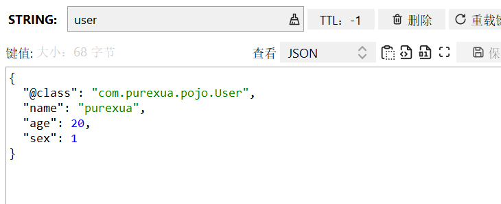
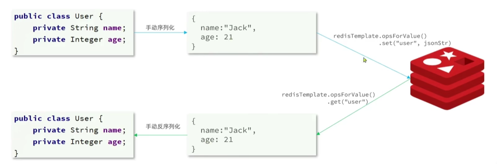
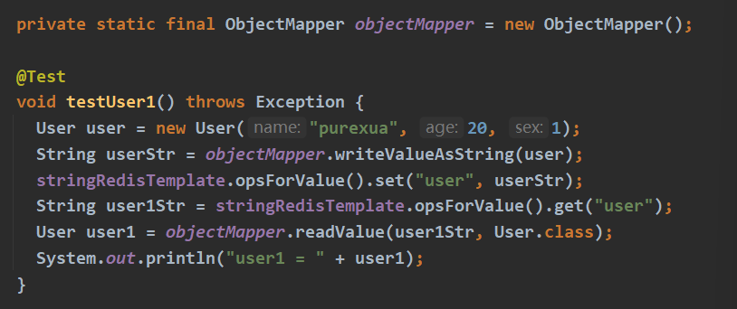

## 关于使用 RedisTemplate 涉及到的序列化操作

> [!TIP]
>
> Author: purexua
>
> Date: 2024-2-4
>
> Tag: **Java** | **JSON** 

在使用 RedisTemplate 时，为了在反序列化时候知道对象的类型，JSON 序列化器会将类的 class 类型写入 json 结果中，存入 Redis，会带来额外的内存开销。

为了节省内存空间，我们并不会使用 JSON 序列化器来处理 value，而是统一使用 String 序列化器，要求只能存储 String 类型的 Key 和 value。

当需要存储 Java 对象时，手动完成对象的序列化和反序列化。

补充：

我们可以使用的 JSON 工具有很多，例如：

- [JDK](https://docs.oracle.com/en/java/javase/17/docs/api/java.base/java/io/ObjectOutputStream.html)

  > Java标准库提供了`ObjectOutputStream`和`ObjectInputStream`类，它们分别用于将对象序列化为字节流和从字节流反序列化为对象。这是Java原生的序列化方式。

- [Jackson](https://github.com/FasterXML/jackson)

  > Jackson 是一个流行的 JSON 处理库，它提供了简单易用的 API 来序列化和反序列化 Java 对象到 JSON 和从 JSON 到 Java 对象。你可以使用 `ObjectMapper` 类来进行序列化和反序列化操作。

- [Gson](https://github.com/google/gson)

  > Gson 是 Google 提供的另一个流行的 JSON 序列化/反序列化库。它提供了简单的 API 来将 Java 对象序列化为 JSON 字符串以及从 JSON 字符串反序列化为 Java 对象。

- [FastJson](https://github.com/alibaba/fastjson)

  > Fastjson 是阿里巴巴开发的 JSON 序列化/反序列化库，它被认为是 Java 中性能最快的 JSON 处理库之一。它提供了丰富的 API 来序列化和反序列化 Java 对象到 JSON 和从 JSON 到 Java 对象。

- [Kryo](https://github.com/EsotericSoftware/kryo)

  > Kryo 是一个快速的 Java 序列化/反序列化库，它的性能比 Java 标准库的序列化更好。Kryo 可以序列化几乎所有 Java 对象，而且速度非常快，但它不支持跨语言序列化。

- [Protobuf](https://github.com/protocolbuffers/protobuf)

  > Protocol Buffers (protobuf) 是 Google 提供的一种跨语言的序列化框架。它不同于 JSON 和 XML，它使用二进制格式来序列化数据，因此更加紧凑和高效。在 Java 中，你可以使用 protobuf 提供的 API 来进行序列化和反序列化操作。